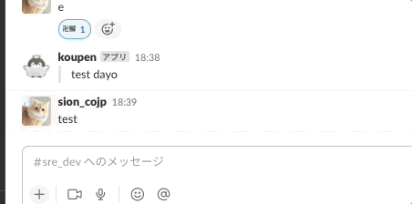

# slack-reaction-hook


slackのリアクションをhookにして何かしらアクションを起こすサンプル実装


# deployment

```shell
# constの設定を変えてください。本当はflagや環境変数渡しにしたほうがいいですね
$ make build
$ ./bin/slack-reaction-hook
```

# development

```shell
# moduleの追加
$ make get MODULE=go.uber.org/zap
```