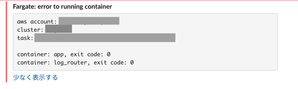
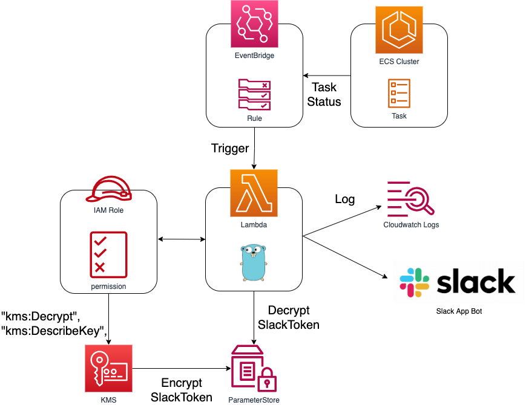

# fargate-non-exit-0-notify


- exit 0以外をslackに通知させる

## Required
- 事前にKMS + ParameterStoreでslackのtoken（xoxb....）を保存しておくこと

## Usage
```hcl
module "fargate-non-exit-0-notify" {
  source = "modules/fargate-non-exit-0-notify"
  slack_channel_name  = "#slack_channel_name"
  ecs_cluster_arn     = data.aws_ecs_cluster.xxx.arn
  aws_account_id      = data.aws_caller_identity.self.id
  kms_arns = [
    data.aws_kms_alias.xxx.target_key_arn
  ]
}

data "aws_ecs_cluster" "xxx" {
  cluster_name = "xxx"
}

data "aws_kms_alias" "xxx" {
  name = "alias/xxx"
}
```

## architecture


1. cloudwatch eventsでtaskのstatusをwatch
2. status変動でlambdaが発火。
3. Goでジャッジし、slackに通知

## deployment
```shell
### go buildする
$ cd module...../fargate-non-exit-0-notify/files
$ make

### あとはterraformを打ってください
```

## tips
- 既知の把握で、slack通知がうるさいとき
- 対象のcloudwautwath eventを手動で有効化/無効化すると通知OFFできます
  
## development
### slack
- https://api.slack.com/apps
- からapp登録してください

### debug
- lambda * cloudwatch eventなので、printデバッグで。。
- 対象のcloudwautwath eventを手動で有効化/無効化するとデバッグしやすいです
    - lambda-fargate-non-exit-0-notify というevents名

### lambdaの実行ログ
- cloudwatch logsの `/aws/lambda/fargate-non-exit-0-notify` にあります
